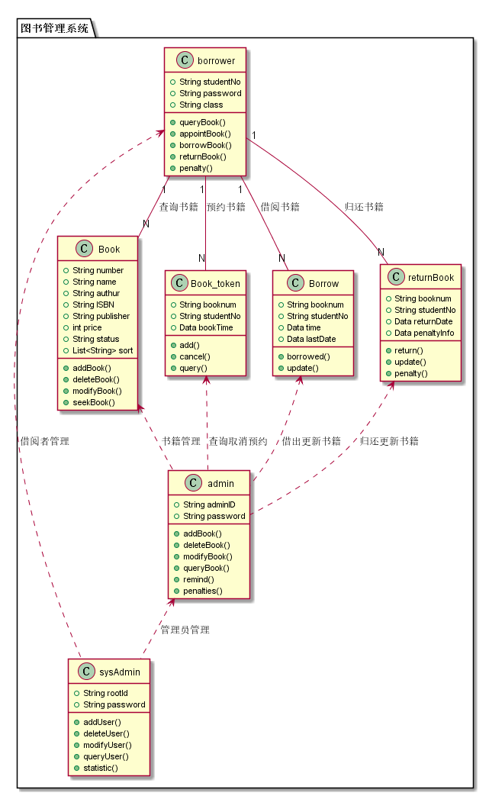
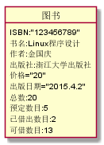
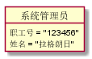
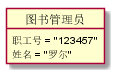
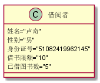
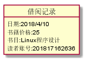
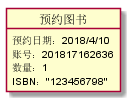
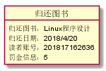

# 实验三：图书管理系统领域对象建模
<table>
<tr>
<td>学号</td>
<td>班级</td>
<td>姓名</td>
</tr>
<tr>
<td>201510414210</td>
<td>15级软件工程二班</td>
<td>卢奇</td>
</tr>
</table>

## 1 图书管理系统类图
### 1.1 类图PlantUML源代码:
```
@startuml test3

package "图书管理系统" {

class admin{
     +String adminID
     +String password

     +addBook()
     +deleteBook()
     +modifyBook()
     +queryBook()
     +remind()
     +penalties()
 }
class sysAdmin {
   +String rootId
   +String password

   +addUser()
   +deleteUser()
   +modifyUser()
   +queryUser()
   +statistic()
}
class Book {
   +String number
   +String name
   +String authur
   +String ISBN
   +String publisher
   +int price
   +String status
   +List<String> sort
   +addBook()
   +deleteBook()
   +modifyBook()
   +seekBook()
}
class Book_token {
  +String booknum
  +String studentNo
  +Data bookTime
  +add()
  +cancel()
  +query()
}
class Borrow {
  +String booknum
  +String studentNo
  +Data time
  +Data lastDate
  +borrowed()
  +update()
}
class returnBook {
  +String booknum
  +String studentNo
  +Data returnDate
  +Data penaltyInfo
  +return()
  +update()
  +penalty()
}
class borrower {
   +String studentNo
   +String password
   +String class
   +queryBook()
   +appointBook()
   +borrowBook()
   +returnBook()
   +penalty()
}

borrower"1" -- "N"Book:查询书籍
borrower"1" -- "N"Book_token:预约书籍
borrower"1" -- "N"Borrow:借阅书籍
borrower"1" -- "N"returnBook:归还书籍
Book <.. admin:书籍管理
Borrow <.. admin:借出更新书籍
returnBook <.. admin:归还更新书籍
Book_token <.. admin:查询取消预约
borrower <.. sysAdmin:借阅者管理
admin <.. sysAdmin:管理员管理
}

@enduml
```
### 1.2 类图如下：


### 1.3 类图说明：
上图由系统管理员，图书管理员，借阅者，图书预订，归还图书，借阅图书，图书类组成，其中，图书管理员可以对图书信息修改，读者可以通过直接借书和预约借书，借书后通过管理员进行归还图书。

## 2 图书管理系统的各个对象图及源码
### 2.1 图书类的对象：
#### 源码：
    @startuml
    object 图书{
     ISBN:"123456789"
     书名:Linux程序设计
     作者:金国庆
     出版社:浙江大学出版社
     价格="20"
     出版日期="2015.4.2"
     总数:20
     预定数目:5
     已借出数目:2
     可借数目:13
    }
    @enduml

#### 对象图：


### 2.2 系统管理员类的对象:
#### 源码：
    @startuml
    Object 系统管理员{
    职工号 = "123456"
    姓名 = "拉格朗日"
    }
    @enduml

#### 对象图：


### 2.3 图书管理员类的对象:
#### 源码：
    @startuml
    Object 图书管理员{
    职工号 = "123457"
    姓名 = "罗尔"
    }
    @enduml

#### 对象图：


### 2.4 借阅者类的对象:
#### 源码：
    @startuml
    Class 借阅者{
    姓名="卢奇"
    性别="男"
    身份证号="51082419962145"
    借书限额="10"
    已借图书数="5"
    }
    @enduml

#### 对象图：


### 2.5 借阅类的对象:
#### 源码：
    @startuml
    object 借阅记录{
        日期:2018/4/10
        书籍价格:25
        书目:Linux程序设计
        读者账号:201817162636
    }
    @enduml

#### 对象图：


### 2.6 预约类的对象:
#### 源码：
    @startuml
    object 预约图书{
         预约日期：2018/4/10
         账号：201817162636
         数量：1
         ISBN："123456798"
    }
    @enduml

#### 对象图：


### 2.6 归还图书类的对象:
#### 源码：
    @startuml
    object 归还图书{
         归还图书：Linux程序设计
         归还日期：2018/4/20
         读者账号：201817162636
         罚金信息：5
    }
    @enduml

#### 对象图：
