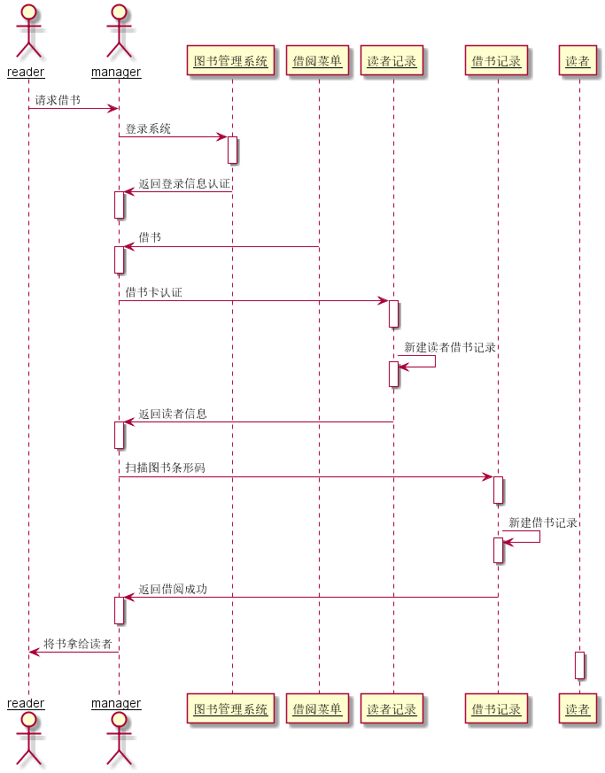
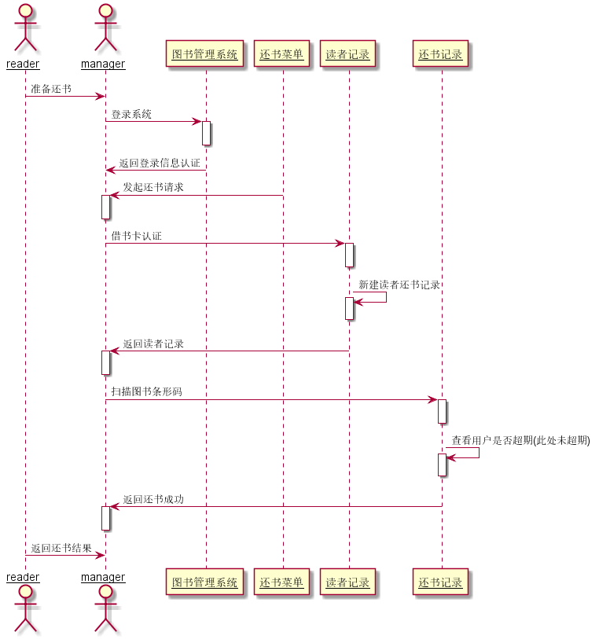
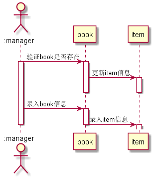
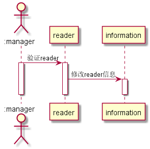
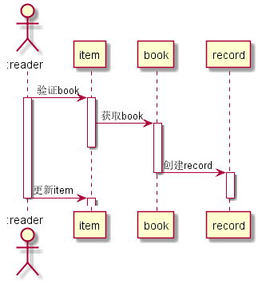
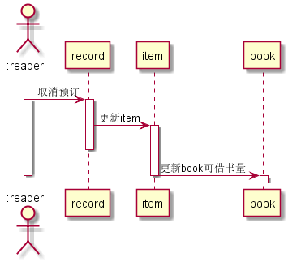

# 实验四：图书管理系统顺序图绘制

|学号|班级|姓名|
|:---:|:---:|:----:|
|201510414210|2015软件2班|卢奇|

### 图书管理系统的顺序图

### 1.  借书用例顺序图

##### 1.1 借书用例PlantUML源码：

    @startuml
    skinparam sequenceParticipant underline

    actor 读者 #blue
    actor manager #red

    读者->manager:请求借书

    manager -> 图书管理系统: 登录系统
    activate 图书管理系统
    deactivate 图书管理系统

    图书管理系统 -> manager: 返回登录信息认证
    activate manager
    deactivate manager

    借阅菜单 -> manager: 借书
    activate manager
    deactivate manager

    manager->读者记录:借书卡认证
    activate 读者记录
    deactivate 读者记录

    读者记录->读者记录:新建读者借书记录
    activate 读者记录
    deactivate 读者记录

    读者记录->manager:返回读者信息
    activate manager
    deactivate manager

    manager->借书记录:扫描图书条形码
    activate 借书记录
    deactivate 借书记录

    借书记录->借书记录:新建借书记录
    activate 借书记录
    deactivate 借书记录

    借书记录->manager:返回借阅成功
    activate manager
    deactivate manager

    manager->读者:将书拿给读者
    activate 读者
    deactivate 读者
    @enduml
  
 ##### 1.2. 借书用例顺序图：

#### 1.3. 借书用例顺序图说明：
读者通过图书管理员进行借书操作，管理员登录系统，认证读者信息并进行借书操作，系统对图书条形码进行校验，新建借书记录，完成借书。

### 2. 还书用例顺序图

#####  2.1 还书用例PlantUML源码：
    @startuml
    skinparam sequenceParticipant underline

    actor reader
    actor manager 

    reader -> manager: 准备还书

    manager -> 图书管理系统: 登录系统
    activate 图书管理系统
    deactivate 图书管理系统

    图书管理系统 -> manager: 返回登录信息认证
    deactivate manager

    还书菜单 -> manager: 发起还书请求
    activate manager
    deactivate manager

    manager->读者记录:扫描读者一卡通
    activate 读者记录
    deactivate 读者记录

    读者记录->读者记录:新建记录读者还书
    activate 读者记录
    deactivate 读者记录

    读者记录->manager:返回读者记录
    activate manager
    deactivate manager

    manager->还书记录:扫描图书条形码
    activate 还书记录
    deactivate 还书记录

    还书记录->还书记录:查看用户是否超期(此处未超期)
    activate 还书记录
    deactivate 还书记录

    还书记录->manager:返回还书成功
    activate manager
    deactivate manager

    reader -> manager: 返回还书结果

    @enduml
##### 2，2还书用例顺序图

##### 2.3还书用例顺序图说明
读者通过图书管理员进行还书操作，管理员登录系统，认证读者信息并进行换书操作，系统对图书条形码进行校验，新建还书记录，完成还书。

#### 3 维护图书用例顺序图
#####  3.1 维护图书用例PlantUML源码：
        @startuml
        actor ":manager" as librarian
        participant "book"
        participant "item"

        librarian -> book: 验证book是否存在
        activate librarian
        activate book
        book -> item: 更新item信息
        activate item
        deactivate book
        deactivate item
        librarian -> book: 录入book信息
        activate book
        book -> item:录入item信息
        deactivate book
        activate item
        deactivate librarian
        @enduml
##### 3.2 维护图书用例顺序图

 
 ##### 3.3 维护图书用例顺序图说明
管理员维护图书时，判断书籍是否存在，若存在更新图书项信息，不存在则录入图书项信息。

#### 4 维护读者用例的顺序图
#####  4.1维护读者顺序图源码如下：
    @startuml
    actor ":manager" as librarian
    participant "reader"
    participant "information"
    
    librarian -> reader: 验证reader
    activate librarian
    activate reader
    reader -> information: 修改reader信息
    activate information
    deactivate reader
    deactivate information
    deactivate librarian
    @enduml
##### 4.2维护读者顺序图：

##### 4.3维护读者顺序图说明
管理员验证读者的信息，成功后进行读者信息修改。

#### 5 预订图书用例的顺序图
#####  5.1预订图书顺序图源码如下：
    @startuml
    actor ":reader" as reader
    participant "item"
    participant "book"
    participant "record"
    reader -> item: 验证book
    activate reader
    activate item
    item -> book: 获取book
    activate book
    deactivate item
    book -> record: 创建record
    deactivate book
    activate record
    reader -> item: 更新item
    deactivate record
    activate item
    deactivate reader
    @enduml
##### 5.2预订图书用例顺序图：

##### 5.3预订图书用例顺序图说明
 系统验证读者，读者输入资源项信息，查找图书，找到后预订创建预订记录，更新资源项信息。

#### 6 取消预订用例的顺序图
#####  6.1取消预订用例的顺序图源码如下：
    @startuml
    actor ":reader" as reader
    participant "record"
    participant "item"
    participant "book"
    reader -> record: 取消预订
    activate reader
    activate record
    record -> item: 更新item
    activate item
    deactivate record
    item -> book: 更新book可借书量
    deactivate item
    activate book
    deactivate reader
    @enduml
##### 6.2 取消预订用例的顺序图

##### 6.3 取消预订用例的顺序图说明
读者登录账号，找到自己的预定记录，点击取消预定，更新资源项信息，更新图书的可借书量。

