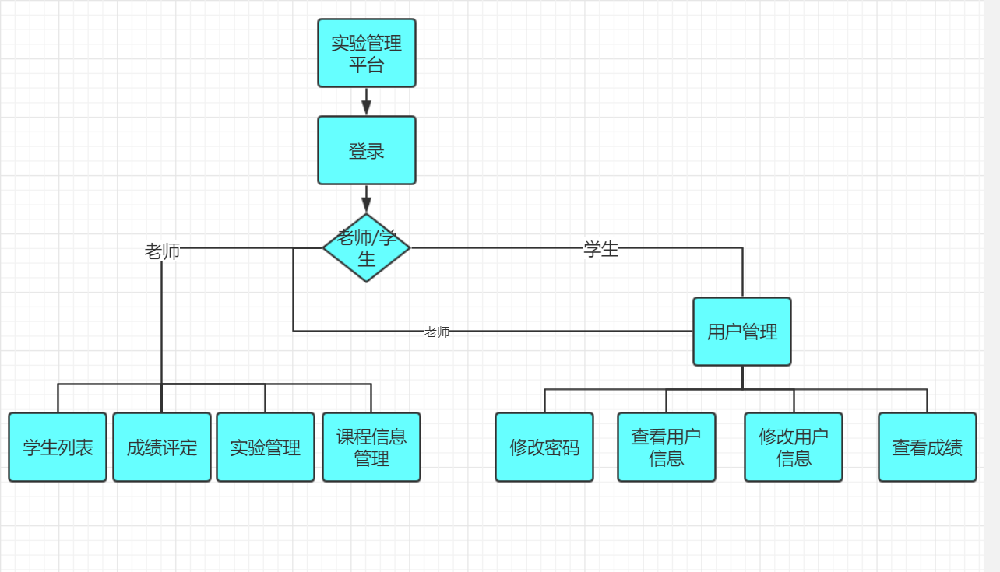
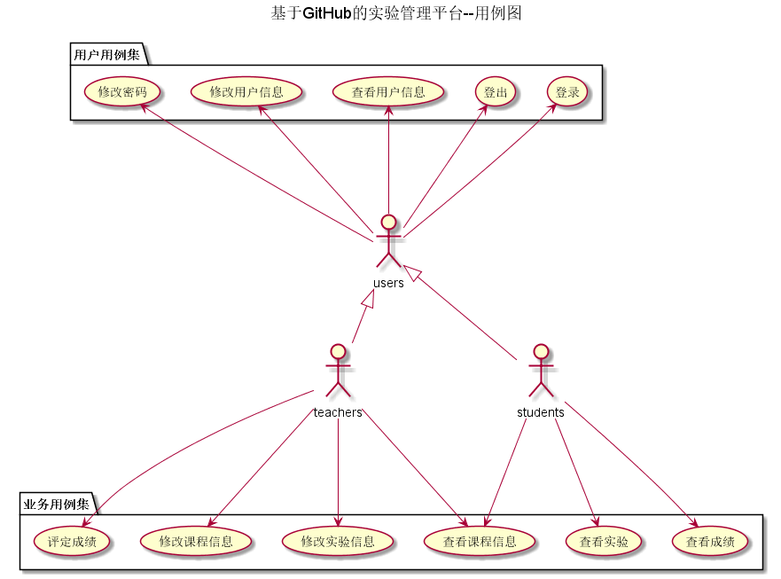
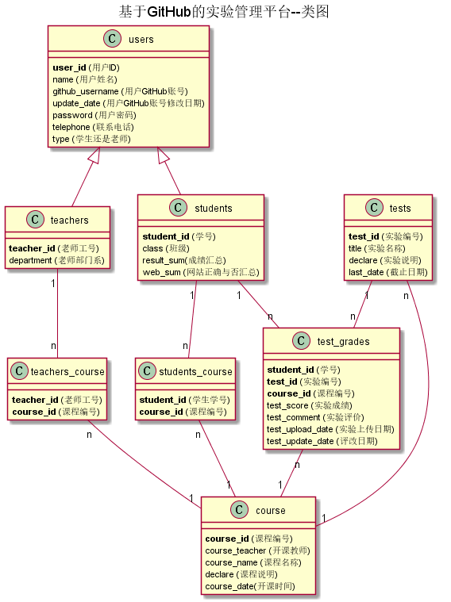

# 基于GitHub的实验管理平台的分析与设计

### 成都大学信息科学与工程学院

#

|学号|班级|姓名
|:-------:|:-------------: | :----------:|
|201510414210|软件(本)15-2|卢奇|

## 1. 概述
*   基于GitHub的实验管理平台的作用是在线管理实验成绩的Web应用系统。学生和老师的实验内容均存放在GitHUB 页面上。
*   学生的功能主要有：一是设置自己的GitHub用户名，二是查询自己的实验成绩。
*   老师的功能主要有：一是修改课程信息，二是批改每个学生的成绩。
*   实验成绩按数字分数计算，每项实验的满分为100分，最低为0分。
*   系统自动计算每个学生的所有实验的平均分。
*   老师和学生都必须先登录系统，登录后选择需要操作的课程，然后对每个实验进行操作。
    
## 2. 系统总体结构

界面设计参见：https://xinqi7.github.io/is_analysis/test6/ui/index.html
    
## 3. 用例图设计 [源码](src/UseCase.puml)

## 4. 类图设计 [源码](src/class.puml)

## 5. 数据库设计
- ### [参见数据库设计](./数据库设计.md)

## 6. 用例及界面详细设计

- ### [“登录”用例](./用例/登录.md),[界面](https://xinqi7.github.io/is_analysis/test6/ui/index.html)
- ### [“查看课程列表”用例](./用例/查看课程列表.md),[界面](https://xinqi7.github.io/is_analysis/test6/ui/查看课程列表.html)
- ### [“查看课程学生信息”用例](./用例/查看课程学生信息.md),[界面](https://xinqi7.github.io/is_analysis/test6/ui/查看课程学生信息.html)
- ### [“修改密码”用例](./用例/修改密码.md),[界面](https://xinqi7.github.io/is_analysis/test6/ui/修改密码.html)
- ### [“修改用户信息”用例](./用例/修改用户信息.md),[界面](https://xinqi7.github.io/is_analysis/test6/ui/修改用户信息.html)
- ### [“用户信息”用例](./用例/用户信息.md),[界面](https://xinqi7.github.io/is_analysis/test6/ui/用户信息.html)
- ### [“实验作业”用例](./用例/实验作业.md),[界面](https://xinqi7.github.io/is_analysis/test6/ui/实验作业.html)
- ### [“修改实验作业”用例](./用例/修改实验作业.md),[界面](https://xinqi7.github.io/is_analysis/test6/ui/修改实验作业.html)
- ### [“添加实验”用例](./用例/添加实验.md),[界面](https://xinqi7.github.io/is_analysis/test6/ui/添加实验.html)
- ### [“课程信息”用例](./用例/课程信息.md),[界面](https://xinqi7.github.io/is_analysis/test6/ui/课程信息.html)
- ### [“修改课程信息”用例](./用例/修改课程信息.md),[界面](https://xinqi7.github.io/is_analysis/test6/ui/修改课程信息.html)
- ### [“评定成绩”用例](./用例/评定成绩.md),[界面](https://xinqi7.github.io/is_analysis/test6/ui/评定成绩.html)
- ### [“登出”用例](./用例/登出.md),[界面](https://xinqi7.github.io/is_analysis/test6/ui/登出.html)

    