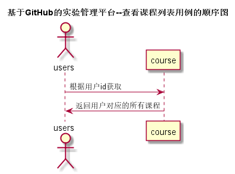

<!-- markdownlint-disable MD033-->
<!-- 禁止MD033类型的警告 https://www.npmjs.com/package/markdownlint -->

# “查看课程列表”用例 [返回](../README.md)
## 1. 用例规约

|用例名称|评定成绩|
|-------|:-------------|
|功能|用户获取自己对应的所有课程|
|参与者|老师，学生|
|前置条件|用户必须登录|
|后置条件| 用户登录后，根据id返回所有的课程信息|
|主流事件| |
|备注| |

## 2. 业务流程（顺序图） [源码](../src/查看课程列表.puml)
 

    
## 3. 界面设计
- 界面参照: https://xinqi7.github.io/is_analysis/test6/ui/查看课程列表.html

- API接口调用
	- 接口：[getCourse](../接口/getCourses.md)
	  用于获取学生的所有课程
	
    
## 4. 算法描述
    无
    
## 5. 参照表

- [COURSE](../数据库设计.md/#COURSE)
- [STUDENTS](../数据库设计.md/#STUDENTS)
- [TEACHERS](../数据库设计.md/#TEACHERS)
- [STUDENTS_COURSE](../数据库设计.md/#STUDENTS_COURSE)
- [TEACHERS_COURSE](../数据库设计.md/#TEACHERS_COURSE)

