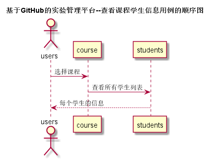

<!-- markdownlint-disable MD033-->
<!-- 禁止MD033类型的警告 https://www.npmjs.com/package/markdownlint -->

# “查看课程学生信息”用例 [返回](../README.md)
## 1. 用例规约

|用例名称|学生列表|
|-------|:-------------|
|功能|以表形式的显示出所有学生的信息|
|参与者|老师|
|前置条件|老师需要先登录|
|后置条件| |
|主流事件| |
|备注| |

## 2. 业务流程（顺序图） [源码](../src/查看课程学生信息.puml)
 

## 3. 界面设计
- 界面参照: https://xinqi7.github.io/is_analysis/test6/ui/查看课程学生信息.html
- API接口调用

	- 接口1：[getCourses](../接口/getCourses.md)
	  用于获取用户对应的所有课程

    - 接口2：[getStudents](../接口/getStudents.md) 
		用于获取课程对应的所有学生	
		
## 4. 算法描述

    
## 5. 参照表

- [COURSE](../数据库设计.md/#COURSE)
- [STUDENTS](../数据库设计.md/#STUDENTS)
- [STUDENTS_COURSE](../数据库设计.md/#STUDENTS_COURSE)
- [TEACHERS_COURSE](../数据库设计.md/#TEACHERS_COURSE)

